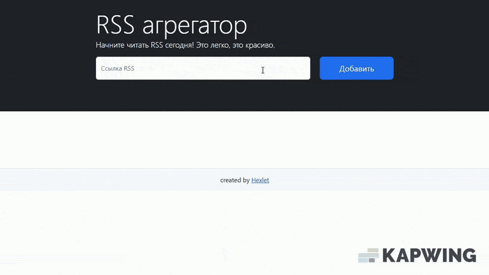

# Rss Reader 
[](https://github.com/AnastasiaVAV/frontend-project-11/actions)
[](https://sonarcloud.io/summary/new_code?id=AnastasiaVAV_frontend-project-11)

Сервис для агрегации RSS-лент. Позволяет добавлять неограниченное количество источников, автоматически обновлять ленту и читать новости без перехода на внешние сайты

Cсылка на проект – https://frontend-project-11-eosin-sigma.vercel.app/

## Особенности проекта
- Добавление RSS-лент по URL (с валидацией)
- Автоматическое обновление ленты (каждые 5 секунд)
- Просмотр контента без перехода на внешние сайты
- Локализация
- Обработка сетевых ошибок
- Адаптивный интерфейс

## Технологии


    

**Библиотеки:**
- `axios` – HTTP-запросы
- `i18next` – интернационализация
- `lodash` – утилиты
- `on-change` – отслеживание изменений состояния
- `yup` – валидация данных

## Установка и запуск
1.  Установите зависимости:
    ```bash
    npm install
    ```
2.  Запустите приложение в режиме разработки:
    ```bash
    npm run dev
    ```
3.  Откройте [http://localhost:5173](http://localhost:5173) в браузере.

## Демонстрация работы
